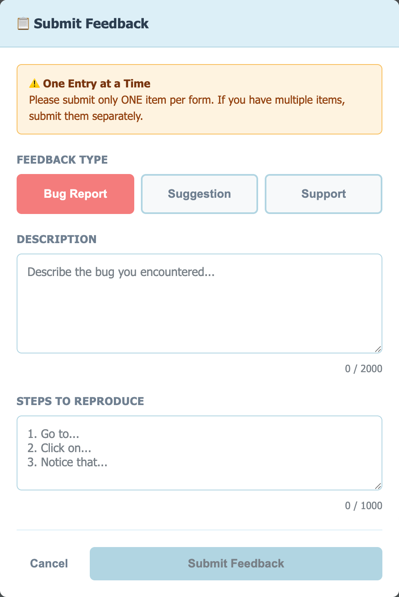
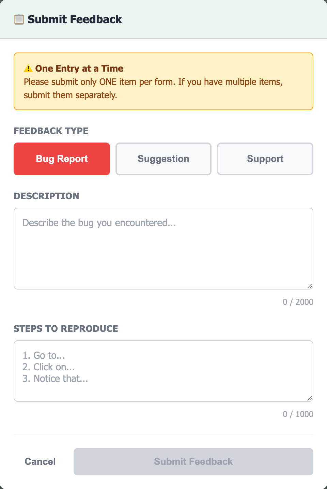
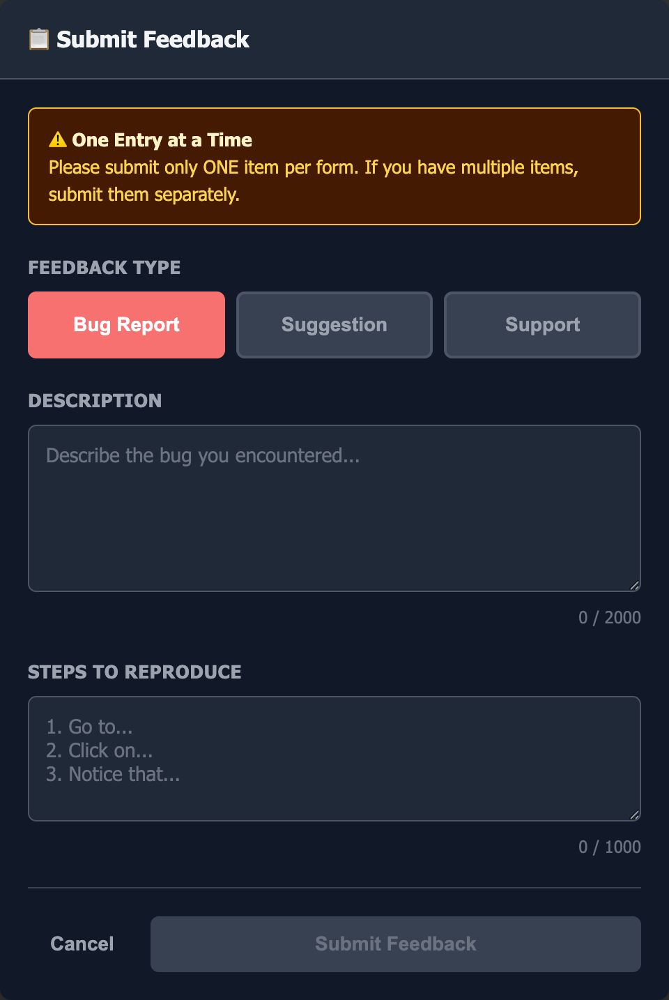

# BetaHub Feedback Widget

A lightweight, embeddable feedback widget for games and web applications. Allow your users to submit bug reports, feature suggestions, and support tickets directly from your app.

## Features

- **Three Feedback Types**: Bug reports, suggestions, and support tickets
- **Multi-language Support**: Built-in translations for English, French, German, Spanish, and Portuguese with auto-detection
- **Flexible Contact Handling**: 5 different modes for capturing user email (anonymous, required, prefilled visible/hidden, auto)
- **Virtual User Creation**: Automatically creates/links users by email without requiring full registration
- **Zero Dependencies**: Pure vanilla JavaScript with no external libraries
- **Shadow DOM Isolation**: Complete CSS isolation - won't conflict with your app's styles
- **Beautiful Design**: Pastel blue minimalistic light theme
- **Custom Metadata**: Include game version, player level, and any custom data with submissions
- **Responsive**: Works on desktop and mobile devices
- **Programmable API**: Open the widget programmatically via JavaScript
- **Game Engine Compatible**: Works with PixiJS, Phaser, Unity WebGL, Three.js, and any HTML5 game

## Demo

- **[View Live Demo](https://betahub.io/demos/html-widget/demo.html)** - See the widget in action!

## Screenshots

The widget comes with three built-in color themes:

### Pastel Blue Theme (Default)


### Light Theme


### Dark Theme


## Quick Start

### 1. Include the Widget

```html
<script src="betahub-widget.js"></script>
```

### 2. Initialize

```javascript
BetaHubWidget.init({
  projectId: 'your-project-id',
  authToken: 'tkn-your-auth-token'
});
```

That's it! The widget will appear as a floating button in the bottom-right corner.

### 3. Get Your Credentials

1. Go to your [BetaHub project dashboard](https://app.betahub.io)
2. Navigate to **Project → Integrations → Auth Tokens**
3. Create a new auth token with these permissions:
   - `can_create_bug_report`
   - `can_create_feature_request`
   - `can_create_support_ticket` (if using support tickets)
4. Copy your project ID and the generated token
5. Use them in the widget initialization

## Configuration

### Required Parameters

| Parameter | Description |
|-----------|-------------|
| `projectId` | Your BetaHub project ID |
| `authToken` | Authentication token (format: `tkn-...`) |

### Optional Parameters

| Parameter | Type | Default | Description |
|-----------|------|---------|-------------|
| `apiBaseUrl` | string | `'https://app.betahub.io'` | BetaHub API endpoint |
| `releaseLabel` | string | `null` | Version label for bug reports (auto-creates release if doesn't exist). If not provided, bugs are assigned to the project's latest release |
| `position` | string | `'bottom-right'` | Button position: `'bottom-right'`, `'bottom-left'`, `'top-right'`, `'top-left'` |
| `locale` | string | `'auto'` | Language: `'auto'`, `'en'`, `'fr'`, `'de'`, `'es'`, `'pt'` (auto-detects from browser) |
| `translations` | object | `{}` | Custom translation overrides (see [Localization](#localization)) |
| `customFields` | object | `{}` | Custom metadata sent with every submission |
| `userEmail` | string | `null` | Pre-filled user email (creates/links virtual user) |
| `requireEmail` | boolean | `false` | Require email for bugs/suggestions (tickets always require) |
| `showEmailField` | string | `'auto'` | Email field visibility: `'auto'`, `'always'`, `'never'` |
| `theme` | string | `'pastel-blue'` | Color theme: `'pastel-blue'`, `'light'`, `'dark'` |
| `styleOverrides` | object | `{}` | CSS variable overrides for custom colors |
| `enabledTypes` | array | `['bug', 'suggestion', 'support']` | Enabled feedback types |

> **Deprecated**: `buttonText` - Use `translations: { buttonText: 'Your Text' }` instead.

### Full Configuration Example

```javascript
BetaHubWidget.init({
  projectId: 'pr-1234567890',
  authToken: 'tkn-your-auth-token-here',

  // Optional configuration
  apiBaseUrl: 'https://app.betahub.io',
  releaseLabel: '1.2.3',             // Version label (auto-creates release if not exists)
  position: 'bottom-right',

  // Localization
  locale: 'auto',                    // 'auto', 'en', 'fr', 'de', 'es', 'pt'
  translations: {                    // Override specific strings
    buttonText: 'Report Bug'
  },

  // Theme customization
  theme: 'pastel-blue',              // 'pastel-blue', 'light', or 'dark'
  enabledTypes: ['bug', 'suggestion', 'support'], // Enabled feedback types

  // Contact information
  userEmail: 'player@example.com',  // Pre-filled user email
  requireEmail: false,               // Require email for bugs/suggestions
  showEmailField: 'auto',            // 'auto', 'always', or 'never'

  // Custom fields (great for games!)
  customFields: {
    platform: 'web',
    playerLevel: 15,
    currentScene: 'battle-arena',
    sessionId: 'abc-123-def-456'
  }
});
```

These custom fields will be automatically included with every bug report, feature request, and support ticket submission.

## Contact Information Modes

The widget supports flexible contact information handling to suit different use cases:

### Mode 1: Anonymous (Default)
```javascript
BetaHubWidget.init({
  projectId: 'pr-123',
  authToken: 'tkn-abc'
  // No email config
});
```
- **Bugs/Suggestions**: Anonymous (no email field)
- **Support Tickets**: Email field shown (required)
- **Best for**: Public feedback where user identity is optional

### Mode 2: Required Email
```javascript
BetaHubWidget.init({
  projectId: 'pr-123',
  authToken: 'tkn-abc',
  requireEmail: true
});
```
- **All Types**: Email field shown and required
- **Best for**: Tracking all feedback to specific users

### Mode 3: Prefilled Visible
```javascript
BetaHubWidget.init({
  projectId: 'pr-123',
  authToken: 'tkn-abc',
  userEmail: 'player@example.com',
  showEmailField: 'always'
});
```
- **All Types**: Email shown as readonly (user can see but not edit)
- **Best for**: Logged-in users where email is known

### Mode 4: Prefilled Hidden
```javascript
BetaHubWidget.init({
  projectId: 'pr-123',
  authToken: 'tkn-abc',
  userEmail: 'player@example.com',
  showEmailField: 'never'
});
```
- **All Types**: Email sent in header but not visible in UI
- **Best for**: Silent user tracking without showing email

### Mode 5: Prefilled Auto (Smart Default)
```javascript
BetaHubWidget.init({
  projectId: 'pr-123',
  authToken: 'tkn-abc',
  userEmail: 'player@example.com'
  // showEmailField defaults to 'auto'
});
```
- **All Types**: Shows readonly email field automatically when `userEmail` is provided
- **Best for**: Most use cases (smart defaults)

### How It Works

When you provide `userEmail`, the widget:
1. Sends email in the authorization header: `FormUser tkn-abc,email:user@example.com`
2. Creates or reuses a "virtual user" in BetaHub
3. Links all feedback from that email together
4. Allows BetaHub to send notifications about feedback updates

**Note**: Support tickets ALWAYS require contact information. If using anonymous mode, users must enter email manually for tickets.

## Localization

The widget supports multiple languages with built-in translations and custom override capability.

### Built-in Languages

| Code | Language |
|------|----------|
| `en` | English (default) |
| `fr` | French |
| `de` | German |
| `es` | Spanish |
| `pt` | Portuguese |

### Auto-Detection (Default)

By default, the widget automatically detects the user's browser language:

```javascript
BetaHubWidget.init({
  projectId: 'pr-123',
  authToken: 'tkn-abc',
  locale: 'auto'  // Default - detects from navigator.language
});
```

### Force a Specific Language

```javascript
BetaHubWidget.init({
  projectId: 'pr-123',
  authToken: 'tkn-abc',
  locale: 'fr'  // Force French regardless of browser settings
});
```

### Custom Translations

Override any string using the `translations` option:

```javascript
BetaHubWidget.init({
  projectId: 'pr-123',
  authToken: 'tkn-abc',
  locale: 'en',
  translations: {
    buttonText: 'Report Issue',
    modalTitle: 'Send Us Feedback',
    submitButton: 'Send',
    typeBug: 'Bug',
    typeSuggestion: 'Idea',
    typeSupport: 'Help'
  }
});
```

### Available Translation Keys

| Key | Default (English) |
|-----|-------------------|
| `buttonText` | Feedback |
| `modalTitle` | Submit Feedback |
| `successTitle` | Thank You! |
| `errorTitle` | Submission Failed |
| `discardTitle` | Discard Feedback? |
| `feedbackTypeLabel` | Feedback Type |
| `descriptionLabel` | Description |
| `stepsLabel` | Steps to Reproduce |
| `emailLabel` | Email Address |
| `typeBug` | Bug Report |
| `typeSuggestion` | Suggestion |
| `typeSupport` | Support |
| `cancelButton` | Cancel |
| `submitButton` | Submit Feedback |
| `submittingButton` | Submitting... |
| `closeButton` | Close |
| `retryButton` | Try Again |
| `keepWritingButton` | No, Keep Writing |
| `discardButton` | Yes, Discard |
| `bugPlaceholder` | Describe the bug you encountered... |
| `suggestionPlaceholder` | Describe your suggestion in detail... |
| `supportPlaceholder` | What do you need help with? |
| `stepsPlaceholder` | 1. Go to...\n2. Click on...\n3. Notice that... |
| `emailPlaceholder` | your.email@example.com |
| `warningTitle` | One Entry at a Time |
| `warningMessage` | Please submit only ONE item per form... |
| `successMessage` | Your feedback has been submitted successfully... |
| `errorMessage` | We couldn't submit your feedback. Please try again. |
| `errorDefault` | Network error: Unable to reach the server |
| `discardMessage` | Are you sure you want to cancel? Your feedback will be lost. |
| `emailHint` | We'll use this to contact you about updates |

### Translation Priority

1. Custom `translations` object (highest priority)
2. Built-in translations for selected `locale`
3. English defaults (fallback)

This means you can use a built-in language and only override specific strings:

```javascript
BetaHubWidget.init({
  projectId: 'pr-123',
  authToken: 'tkn-abc',
  locale: 'fr',  // Use French translations
  translations: {
    buttonText: 'Signaler'  // Override just this one string
  }
});
```

## Programmatic API

### Opening the Widget

Open the widget programmatically from your code:

```javascript
// Open the feedback widget
BetaHubWidget.open();
```

This is useful for:
- Custom "Report Bug" buttons in your UI
- Keyboard shortcuts (e.g., press F1 to report a bug)
- Context-specific feedback (e.g., "Report issue with this level")

### Updating Custom Fields Dynamically

Update custom fields after initialization to capture real-time game state:

```javascript
// Update custom fields as game state changes
BetaHubWidget.updateCustomFields({
  level: '5',
  score: '1250',
  health: '75'
});
```

This is useful for:
- Capturing current game state (level, score, health) when feedback is submitted
- Updating player progress dynamically during gameplay
- Including real-time context with bug reports

**Example: PixiJS Game Integration**

```javascript
// Initialize once at game start
BetaHubWidget.init({
  projectId: 'your-project-id',
  authToken: 'tkn-your-token',
  customFields: {
    gameVersion: '1.0.0',
    level: '1',
    score: '0'
  }
});

// Update dynamically during gameplay
function onLevelUp(newLevel) {
  BetaHubWidget.updateCustomFields({
    level: newLevel.toString()
  });
}

function onScoreChange(newScore) {
  BetaHubWidget.updateCustomFields({
    score: newScore.toString()
  });
}
```

**Notes:**
- New fields are merged with existing `customFields` (doesn't replace them)
- Call this method anytime after `init()` to update values
- Updated fields will be included in the next feedback submission
- All values should be strings for consistency

## Game Engine Integration

### PixiJS

```javascript
// Add to your game initialization
BetaHubWidget.init({
  projectId: 'your-project-id',
  authToken: 'tkn-your-token',
  customFields: {
    gameVersion: '1.0.0',
    currentLevel: game.currentLevel,
    playerScore: player.score
  }
});
```

### Phaser

```javascript
// In your game's create() function
BetaHubWidget.init({
  projectId: 'your-project-id',
  authToken: 'tkn-your-token',
  customFields: {
    gameVersion: '1.0.0',
    scene: this.scene.key
  }
});
```

### Unity WebGL

```javascript
// In your HTML template file
<script src="betahub-widget.js"></script>
<script>
  // Initialize after Unity loads
  createUnityInstance(canvas, config).then(function(unityInstance) {
    BetaHubWidget.init({
      projectId: 'your-project-id',
      authToken: 'tkn-your-token',
      customFields: {
        unityVersion: '2022.3.1f1',
        platform: 'webgl'
      }
    });
  });
</script>
```

### React

```jsx
import { useEffect } from 'react';

function App() {
  useEffect(() => {
    // Load and initialize widget
    const script = document.createElement('script');
    script.src = '/betahub-widget.js';
    script.onload = () => {
      window.BetaHubWidget.init({
        projectId: 'your-project-id',
        authToken: 'tkn-your-token',
        customFields: {
          appVersion: '1.0.0',
          environment: process.env.NODE_ENV
        }
      });
    };
    document.body.appendChild(script);
  }, []);

  return <div>Your App</div>;
}
```

## Feedback Types

### Bug Reports
- **Requires**: Description + Steps to Reproduce
- **Email**: Optional (unless `requireEmail: true`)
- **Use for**: Crashes, errors, unexpected behavior
- **Endpoint**: `POST /projects/{projectId}/issues.json`

### Suggestions
- **Requires**: Description only
- **Email**: Optional (unless `requireEmail: true`)
- **Use for**: Feature requests, improvements, ideas
- **Endpoint**: `POST /projects/{projectId}/feature_requests.json`

### Support Tickets
- **Requires**: Description + Email (always required)
- **Email**: Always required (user must provide or use prefilled)
- **Use for**: Help requests, questions, general support
- **Endpoint**: `POST /projects/{projectId}/tickets.json`

All requests use `FormUser` authentication with your auth token. Email can be provided via:
- `userEmail` config (sent in header: `FormUser tkn-abc,email:user@example.com`)
- User input in the form field
- Form field takes precedence over header

## Character Limits

- **Description**: 2000 characters
- **Steps to Reproduce**: 1000 characters

## Browser Compatibility

Requires browsers with Shadow DOM support:
- Chrome 53+
- Firefox 63+
- Safari 10.1+
- Edge 79+

## Customization

The widget uses a fixed pastel blue light theme. To customize colors, edit the `getStyles()` method in `betahub-widget.js`:

```javascript
// Primary brand color
background: #237390; // Change to your brand color

// Button hover state
background: #1E627B; // Darker shade of brand color
```

See `CLAUDE.md` for the complete color palette and design guidelines.

## Development

This is a single-file widget with zero build process. To modify:

1. Edit `betahub-widget.js`
2. Test with `demo.html` (use a local web server)
3. No compilation or bundling needed!

```bash
# Serve demo locally
python3 -m http.server 8080
# Open http://localhost:8080/demo.html
```

## Security Notes

- Never commit auth tokens to version control
- Use environment-specific tokens (dev/staging/prod)
- Tokens support rate limiting (default: 8 submissions per day per type per IP)
- Use the BetaHub dashboard to rotate tokens if compromised

## File Structure

```
betahub-html-widget/
├── betahub-widget.js           # Main widget (single file, zero dependencies)
├── demo.html                   # Live demo with documentation
├── README.md                   # This file
└── CLAUDE.md                   # Development guide and architecture docs
```

## License

[Add your license here]

## Support

For issues with the widget itself, open a GitHub issue.

For BetaHub API questions, visit [BetaHub Documentation](https://docs.betahub.io) or contact support@betahub.io.

## Contributing

Contributions welcome! Please:
1. Test your changes with `demo.html`
2. Ensure Shadow DOM isolation isn't broken
3. Maintain the zero-dependency philosophy
4. Update `CLAUDE.md` if changing architecture

---

Made with ❤️ for [BetaHub](https://betahub.io)
